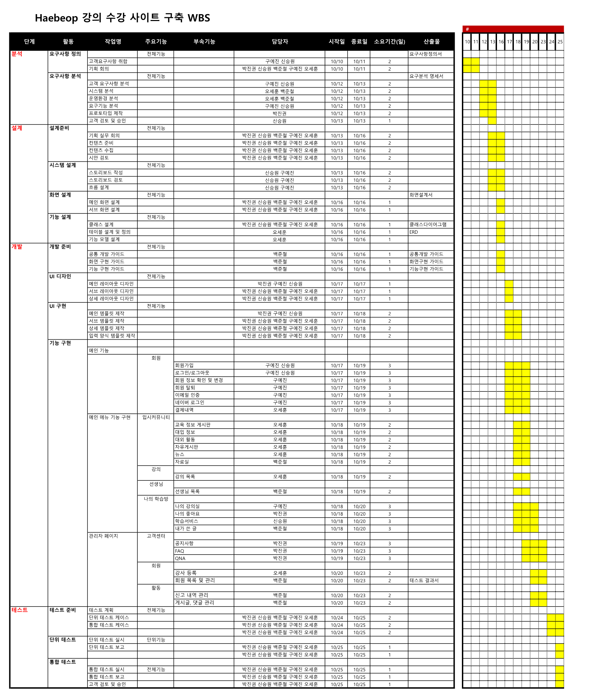
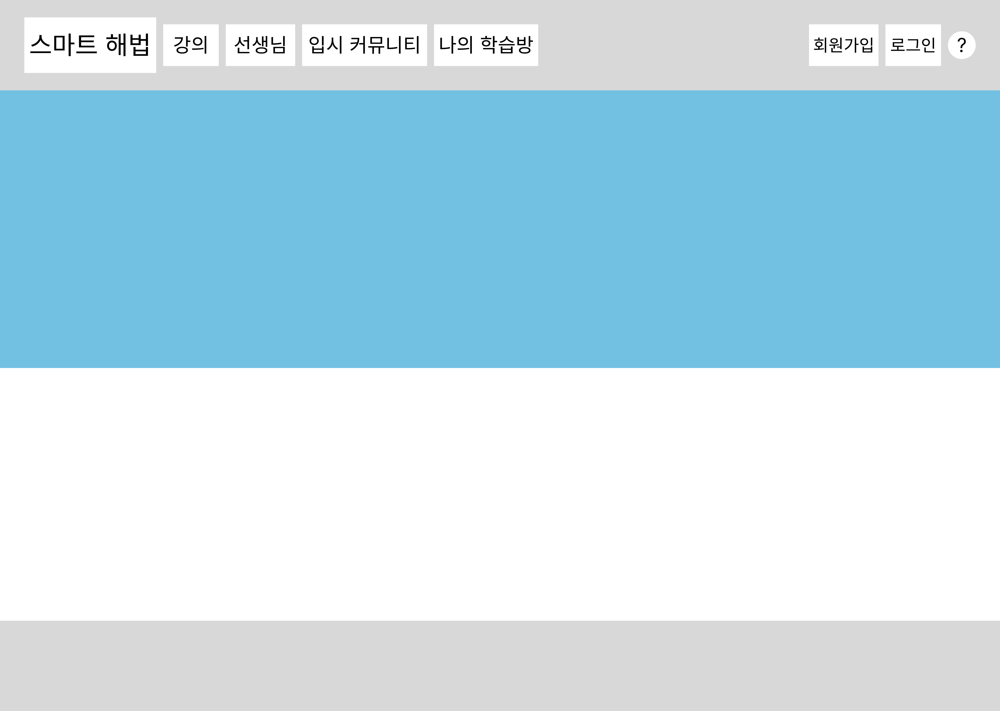
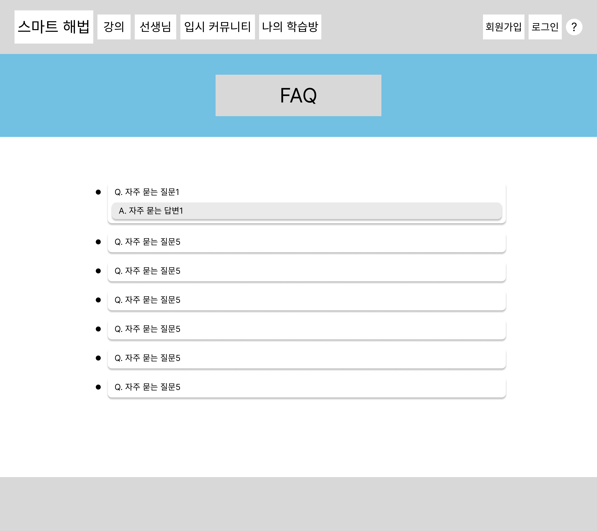

# &nbsp;&nbsp;&nbsp;&nbsp;&nbsp;&nbsp;&nbsp;&nbsp;&nbsp;&nbsp;&nbsp;&nbsp;&nbsp;&nbsp;&nbsp;&nbsp;&nbsp;&nbsp;&nbsp;&nbsp;&nbsp;&nbsp;&nbsp;&nbsp;&nbsp;&nbsp;천재교육 풀스택 과정 4차 프로젝트 
 

&nbsp;&nbsp;&nbsp;&nbsp;&nbsp;&nbsp;&nbsp;&nbsp;&nbsp;&nbsp;&nbsp;&nbsp;&nbsp;&nbsp;&nbsp;&nbsp;&nbsp;&nbsp;&nbsp;&nbsp;&nbsp;&nbsp;&nbsp;&nbsp;&nbsp;&nbsp;&nbsp;&nbsp;&nbsp;&nbsp;&nbsp;&nbsp;&nbsp;&nbsp;&nbsp;&nbsp;&nbsp;&nbsp;&nbsp;&nbsp;&nbsp;&nbsp;&nbsp;&nbsp;&nbsp;&nbsp;&nbsp;&nbsp;&nbsp;&nbsp;&nbsp;&nbsp;&nbsp;&nbsp;&nbsp;&nbsp;&nbsp;&nbsp;&nbsp;&nbsp;
​
  
​
# 📂 프로젝트 소개 
​
안녕하세요!  
**Haebeop**은 학생들을 위한 온라인 강의 플랫폼으로, 
교육에 관한 정보를 공유하고 상호 지원하는 공간을 제공합니다.  
​  
학생들의 성장과 교육 과정을 더욱 효과적으로 관리하고,  
경험을 나누며,  유익한 자원을 활용하여
 **함께 성장할 수 있는 플랫폼을 제공**하는 것이   
 저희 팀의 기획의도 입니다.  
    
 
### &nbsp;&nbsp;&nbsp;&nbsp;&nbsp;&nbsp;&nbsp;&nbsp;&nbsp;&nbsp;&nbsp;&nbsp;&nbsp;&nbsp;&nbsp;&nbsp;&nbsp;&nbsp;&nbsp;&nbsp;&nbsp;&nbsp;&nbsp;&nbsp;&nbsp;&nbsp;&nbsp;&nbsp;&nbsp;&nbsp; 🔹 HAEBEOP 🔹에 대해 자세히 설명해 드릴게요!
### &nbsp;&nbsp;&nbsp;&nbsp;&nbsp;&nbsp;&nbsp;&nbsp;&nbsp;&nbsp;&nbsp;&nbsp;&nbsp;&nbsp;&nbsp;&nbsp;&nbsp;&nbsp;&nbsp;&nbsp;&nbsp;&nbsp;&nbsp;&nbsp;&nbsp;&nbsp;&nbsp;&nbsp;&nbsp;&nbsp;&nbsp;&nbsp;&nbsp;&nbsp;&nbsp;&nbsp;&nbsp;&nbsp;&nbsp;&nbsp;&nbsp;&nbsp;&nbsp;&nbsp;&nbsp;&nbsp;&nbsp;&nbsp;&nbsp;&nbsp;&nbsp;&nbsp;&nbsp;&nbsp;&nbsp;&nbsp;[🙋‍♀️  CLIKE ME  🙋]
 
  
​
​
​
  
​
# 👤 팀원 소개
백준철 - **리더**    &nbsp;&nbsp;관리자 관련 기능 구현, 게시글 신고 기능 구현, 선생님 기능 구현  
구예진 -  **팀원**   &nbsp;&nbsp;회원 관련 기능 구현, 이메일 인증 기능 구현, 나의 학습방 기능 구현 
신승원 -  **팀원**   &nbsp;&nbsp;템플릿 및 전체 CSS 담당, 성적표 게시판 기능 구현, 학습 캘린더 기능 구현 
박진권 -  **팀원**   &nbsp;&nbsp;FAQ 게시판 기능 구현, 공지사항 기능 구현, 게시글 좋아요 기능 구현 
오세훈 - **깃마스터**    &nbsp;&nbsp;뉴스 API 기능 구현, 강의 기능 구현, 결제 기능 구현 
​
 
​
# 🗓 개발일정
2023.10.10 - 2023.10.25
​
 
​

#  🔨 개발스택

### 주요언어
     
 
​
​
​
​
​
​
### 개발환경
  

    
​
 
​
​
​
​
#  👨‍👨 협업 방식
**✔ 언제든 자유롭게 의견내기, 단 강요는 ��‍♂️**   
​
✔   
&nbsp;&nbsp;**개발에 관련된 모든 자료를 공유하며 과정를 기록합니다.**  
​
✔ </a>
&nbsp;&nbsp;**개발 과정에서 발생하는 모든 이슈를 공유하며 협력하여 해결할 수 있도록 합니다.**
​
 
​
 
​
​

# 📅 WBS

​
#  📊 데이터베이스 설계
​
## 1️⃣ 요구사항 분석
🔹비회원🔹 

🔹회원🔹 

🔹관리자🔹 

  
​
## 2️⃣ 개념적 설계
​
### 🔹유즈케이스 (USE CASE)

​
​
## 3️⃣ 논리적 설계

🔹board🔹 
  

🔹boardLikes🔹 
  

🔹cart🔹 
  

🔹course🔹 
  

🔹faq🔹 
  

🔹fileboard🔹 
 

🔹fileobj🔹 
  

🔹grade🔹 
  

🔹info🔹 
 

🔹instfile🔹 
 

🔹instructor🔹 
 

🔹instructorfile🔹 
 

🔹instructornotice🔹 
 

🔹instructorqna🔹 
 

🔹lecfile🔹 
 

🔹lecture🔹 
 

🔹member🔹 
 

🔹notice🔹 
 

🔹payment🔹 
 

🔹qna🔹 
 

🔹report🔹 
 

🔹review🔹 
 

​
## 4️⃣ 물리적 설계 － ＥＲＤ

​
 
 
​
# 📐  클래스 다이어그램

🔹Board🔹 
 
🔹Calendar🔹 
 
🔹Cart🔹 
 
🔹Course🔹 
 
🔹Faq🔹 
 
🔹File🔹 
 
🔹Grade🔹 
 
🔹Info🔹 
 
🔹Instructor🔹 
 
🔹Lecture🔹 
 
🔹Member🔹 
 
🔹Myclass🔹 
 
​🔹Notice🔹 
 
🔹Payment🔹 
 
🔹Qna🔹 
 
🔹Review🔹 
 
​
 
​
​
​
 
​

#  💻 화면 설계도

🔹메인페이지🔹

🔹회원가입🔹

🔹회원정보수정🔹

🔹작성글🔹

🔹결제내역🔹

🔹찜 강의🔹

🔹회원목록🔹

🔹강사등록🔹

🔹신고관리🔹

🔹공지사항 - 목록🔹

🔹공지사항 - 상세🔹

🔹공지사항 - 작성🔹

🔹faq🔹

🔹회원가입🔹

🔹자료실🔹

🔹자료실 - 상세보기🔹

🔹강의🔹

🔹강의 - 상세보기🔹

🔹수강신청🔹

🔹선생님🔹

🔹선생님 - 상세🔹

🔹나의 강의실🔹

🔹성적표🔹

🔹학습계획표🔹

🔹장바구니🔹

 

# 결과 이미지
🔹메인페이지🔹

🔹join🔹

🔹login🔹

🔹비밀번호 찾기🔹

🔹FAQ🔹

🔹QnA🔹

🔹QnA 작성🔹

🔹QnA 상세🔹

🔹QnA비밀번호 입력🔹

🔹공지사항🔹

🔹강의등록🔹

🔹강의목록🔹

🔹강의상세🔹

🔹강의수정🔹

🔹커뮤니티 게시판 상세🔹

🔹결제내역🔹

🔹공지사항🔹

🔹관리자 강사 등록🔹

🔹관리자 게시글 관리🔹

🔹관리자 게시판 댓글 관리🔹

🔹관리자 게시판 신고 내역🔹

🔹내가 작성한 게시글🔹

🔹내가 작성한 댓글🔹

🔹회원 정보 수정🔹

🔹찜강의🔹

🔹추천한 게시글🔹

🔹뉴스🔹

🔹자유게시판🔹

🔹자유게시판 상세🔹

🔹장바구니🔹

🔹정보게시판상세🔹

🔹선생님목록🔹

🔹선생님상세🔹

🔹나의 학습방 - 메인🔹

🔹나의 학습방 - 학습계획표🔹

<!-- 🔹성적표🔹

🔹성적표 상세🔹

🔹성적표 수정🔹
 -->

 

# 결과 gif
🔹강의 등록🔹

🔹관리자 페이지🔹

🔹나의 학습방🔹

🔹선생님🔹

🔹수강신청🔹

🔹입시커뮤니티🔹

🔹좋아요, 찜🔹

